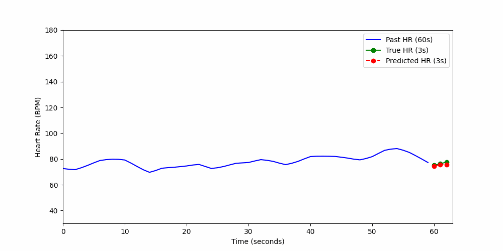

# 🪀 Heart Rate Prediction using reinforcement learning ( PPO and Physiological Signals )

A reinforcement learning model that predicts short-term heart rate using real-time physiological signals (ACC, RESP, TEMP, ACTIVITY, etc.) collected from wearable sensors. Trained using Proximal Policy Optimization (PPO), the model learns to forecast the next 3 seconds of heart rate based on the previous 60 seconds of multimodal data.

---



---

## 📊 Features

- Uses PPO to optimize HR prediction
- Inputs: chest & wrist accelerometer, respiratory, activity, temperature
- Trait inputs (e.g., SPORT category) used as additional conditioning
- Predicts next 3 seconds of heart rate based on past 60 seconds
- Visualized prediction vs ground truth with animated plots
- Test/train split for evaluation

---

## 🧠 Model

The model uses an actor-critic architecture:

- **Input:** Past 60s of signal data + 5D traits vector
- **Output:** Predicted HR deltas for next 3s
- **Loss:** MSE between predicted and true HR values
- **Reward:** Negative of MSE (encouraging accuracy)

---

## 🖼 Visualization

Use interactive animations or GIFs to show:

- Last 60s of signal as context
- Predicted vs actual heart rate over next 3s
- Auto-updating plots (via Streamlit or Matplotlib)

---

## 🧪 How to Use

```bash

# Open the training notebook in Jupyter
jupyter notebook ccfinal-rl-model-env.ipynb

# (Optional) Explore raw or processed data
jupyter notebook ccproject-eda-plots.ipynb
jupyter notebook ccfinal-eda.ipynb

```

---

## 📁 Project Structure

```
📓 ccproject-eda-plots.ipynb       # Raw data exploration and visualization
📓 ccfinal-eda.ipynb       # Processed data analysis
📓 ccfinal-rl-model-env.ipynb # Contains PPO training and environment code
📦 Data_final.npy            # Preprocessed dataset (signals, traits, etc.)
📜 README.md
📄 LICENSE
```

---

## 📓 Notebooks

- [Exploratory Data Analysis (EDA)](https://www.kaggle.com/code/hosseineskandaria/ccproject-eda-plots) : Visual exploration of raw data (distribution, outliers, gaps)
- [Processed Data Preparation](https://www.kaggle.com/code/hosseineskandaria/ccfinal-eda) : Processed dataset analysis and features
- [Training & PPO Environment](https://www.kaggle.com/code/hosseineskandaria/ccfinal-rl-model-env) : Environment setup, PPO model training, and test visualization

---

## 📈 Results

- Final model achieves ~1 bpm absolute error (MAE)
- Stable PPO with clipped loss and normalized inputs
- Model generalizes well on test data


---

## 📄 License

This project is licensed under the [MIT License](./LICENSE).

---

## 🤛 Author

[TEAM CARDIO-CONDUCTOR](https://github.com/Hossein-Eskandari-a)

